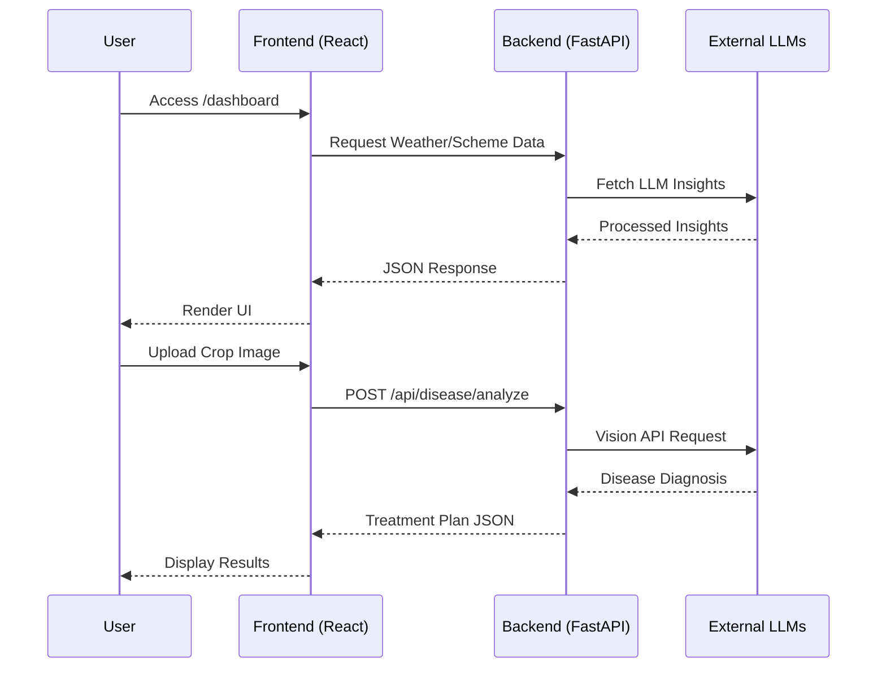

<div align="center">
  
  <h1>AgroSetu (KisanSeva)</h1>
  <p><strong>A Next-Generation Intelligent Climate-Resilient Agricultural Platform</strong></p>

  [](https://reactjs.org/)
  [](https://vitejs.dev/)
  [](https://fastapi.tiangolo.com/)
  [](https://www.docker.com/)
  [](https://github.com/appleboy/ssh-action)
  [](https://opensource.org/licenses/MIT)

  <br />
  <strong>Production URL:</strong> <a href="https://kisanseva.me">https://kisanseva.me</a>
</div>

<hr />

## 📖 Table of Contents
- [Project Overview](#-project-overview)
- [Key Features](#-key-features)
- [Tech Stack](#-tech-stack)
- [System Architecture](#-system-architecture)
- [Directory Structure](#-directory-structure)
- [Local Development Setup](#-local-development-setup)
- [Environment Variables](#-environment-variables)
- [Production Deployment](#-production-deployment)
- [Cloudflare & Domain Configuration](#-cloudflare--domain-configuration)
- [Troubleshooting `kisanseva.me` (Important Fix)](#-troubleshooting-kisansevame-important-fix)
- [API Documentation](#-api-documentation)
- [Security & Performance](#-security--performance)
- [Future Improvements](#-future-improvements)

---

## 🎯 Project Overview
AgroSetu (also known as KisanSeva) is an intelligent, scalable full-stack platform designed to empower farmers with climate-resilient practices. The platform leverages modern LLMs (Groq, Google GenAI, SambaNova) to provide real-time agricultural advice, disease detection via image analysis, weather forecasting, and automated government scheme recommendations.

The application uses a unified architecture where a high-performance **FastAPI backend** serves a lightning-fast **React/Vite SPA**, seamlessly bundled inside a single Docker container for bulletproof deployment on AWS EC2.

---

## ✨ Key Features
- 🤖 **AI-Powered Chat Assistant:** Multi-turn conversational AI for instant farming advice.
- 🍃 **Disease Detection Lens:** Upload crop images to receive instant disease diagnosis and treatment plans via Google GenAI.
- 🌦️ **Weather Integration:** Real-time localized weather insights.
- 📜 **Government Schemes:** Automated filtering and recommendations of applicable farming schemes.
- 💧 **Resource Management:** Land and water management modules.
- 🌍 **Multi-lingual Support:** i18next integrated for broad accessibility.
- 🔒 **Secure Authentication:** Firebase Auth integration.

---

## 🛠️ Tech Stack

### Frontend
- **Framework:** React 19 + TypeScript + Vite
- **Styling:** Tailwind CSS + Framer Motion
- **State Management:** Zustand + React Query
- **Routing:** React Router v7
- **Forms & Validation:** React Hook Form + Zod
- **Auth & Storage:** Firebase

### Backend
- **Framework:** FastAPI (Python 3.10+)
- **Server:** Uvicorn + Gunicorn
- **AI/LLM Providers:** Groq, Google GenAI, SambaNova
- **Image Processing:** Pillow, python-multipart

### DevOps & Infrastructure
- **Hosting:** AWS EC2 (Ubuntu)
- **Containerization:** Docker
- **Reverse Proxy:** Nginx (with Let's Encrypt SSL)
- **DNS/CDN/WAF:** Cloudflare
- **CI/CD:** GitHub Actions (`appleboy/ssh-action`)

---

## 🏗️ System Architecture

The application operates as a Dockerized monolith where FastAPI serves both the REST API endpoints and the statically compiled React SPA.


### Application Flow Diagram



---

## 📁 Directory Structure

```mermaid
graph TD
    Root[agrosetu/] --> FE[frontend/]
    Root --> BE[backend/]
    Root --> GH[.github/workflows/]
    
    FE --> FESRC[src/]
    FESRC --> Pages[pages/ (Dashboard, Login, Disease)]
    FESRC --> Store[store/ (Zustand)]
    FE --> Vite[vite.config.ts]
    
    BE --> Routers[routers/ (chat, disease, weather...)]
    BE --> Services[services/]
    BE --> Main[main.py (FastAPI App)]
    
    GH --> Deploy[deploy.yml (CI/CD)]
    Root --> Docker[Dockerfile]
```

---

## 💻 Local Development Setup

### Prerequisites
- Node.js (v20+)
- Python (3.10+)
- Docker (optional for local run)

### 1. Frontend Setup
```bash
cd frontend
npm install
npm run dev
```

### 2. Backend Setup
```bash
cd backend
python -m venv venv
source venv/bin/activate  # On Windows: venv\Scripts\activate
pip install -r requirements.txt
uvicorn main:app --reload --port 8000
```

---

## 🔐 Environment Variables

The system relies on a `.env` file at the root or within the deployment environment. 

> [!WARNING]
> Never commit `.env` to version control. Use `.env.example` as a template.

| Variable | Location | Description |
|----------|----------|-------------|
| `VITE_FIREBASE_API_KEY` | Frontend | Firebase configuration for Auth |
| `VITE_FIREBASE_PROJECT_ID` | Frontend | Firebase Project ID |
| `GROQ_API_KEY` | Backend | LLM generation for general queries |
| `GEMINI_API_KEY` | Backend | Vision model for disease detection |
| `SAMBANOVA_API_KEY` | Backend | Alternative LLM processing |

---

## 🚀 Production Deployment

Deployment is fully automated via **GitHub Actions**.

### Build Process (Dockerfile)
The `Dockerfile` employs a multi-stage build:
1. **Stage 1 (Node):** Installs dependencies and runs `vite build`, injecting `VITE_FIREBASE_*` build arguments.
2. **Stage 2 (Python):** Installs backend dependencies, copies the `dist` folder from Stage 1 into a `static` folder, and exposes port `8000`.

### CI/CD Pipeline
When code is pushed to the `main` branch, `.github/workflows/deploy.yml` triggers:
1. SSH into the EC2 instance.
2. Pull latest code.
3. Build the Docker image (`agrosetu-app`).
4. Stop the old container and start the new one mapped to **Port 8000**.

---

## 🌐 Cloudflare & Domain Configuration

Your domain `kisanseva.me` is routed through Cloudflare. The setup requires the following for the reverse proxy to function correctly:

1. **DNS Records:**
   - **Type:** A Record
   - **Name:** `@` (and `www`)
   - **Target:** `52.66.238.95`
   - **Proxy Status:** Proxied (Orange Cloud)

2. **Nginx Reverse Proxy on EC2:**
   Nginx intercepts traffic on Port 80/443 and routes it to the Docker container on Port 8000.
   ```nginx
   server {
       listen 80;
       server_name kisanseva.me www.kisanseva.me;
       location / {
           proxy_pass http://127.0.0.1:8000;
           proxy_set_header Host $host;
       }
   }
   ```

---

## 🚨 Troubleshooting `kisanseva.me` (Important Fix)

**Issue:** Visiting `https://kisanseva.me/` results in an **ERR_TOO_MANY_REDIRECTS** (Redirect Loop) or fails to load, while `http://52.66.238.95/` returns a 404.

**Root Cause Analysis:**
1. **The 404 on IP:** This is expected and secure. Nginx is configured to only respond to requests where the `Host` header is `kisanseva.me`. Direct IP access is correctly dropped.
2. **The Redirect Loop:** Since Certbot was run on the EC2 instance to force HTTPS, Nginx will redirect any HTTP request to HTTPS. If Cloudflare's SSL/TLS mode is set to **"Flexible"**, Cloudflare connects to your EC2 instance over HTTP. Nginx replies with a redirect to HTTPS. Cloudflare sends this redirect to the user, creating an infinite loop.

**The Fix:**
1. Log into your **Cloudflare Dashboard**.
2. Navigate to **SSL/TLS -> Overview**.
3. Change the encryption mode from **Flexible** to **Full** or **Full (strict)**.
4. This instructs Cloudflare to connect to Nginx over Port 443 (HTTPS), breaking the loop and securely serving the application.

---

## 🔌 API Documentation

All API routes are prefixed with `/api/`. When deployed, Swagger UI documentation is automatically generated and accessible at `/docs`.

- `POST /api/disease/analyze` - Accepts multipart form data (images) for GenAI crop disease detection.
- `GET /api/weather/current` - Fetches localized weather data.
- `POST /api/chat/message` - Handles multi-turn streaming conversations via Groq.
- `GET /api/schemes/list` - Returns filtered government schemes.

---

## 🛡️ Security & Performance

- **Rate Limiting:** Cloudflare WAF handles basic DDoS mitigation and rate limiting.
- **CORS:** Controlled via FastAPI `CORSMiddleware`. (Set specific origins in production rather than `["*"]`).
- **Static Assets:** Cached dynamically via Cloudflare (`cf-cache-status: DYNAMIC`).
- **State Management:** React Query is utilized for efficient client-side data fetching, caching, and background synchronization, significantly reducing unnecessary backend API calls.

---

## 🔮 Future Improvements

1. **Database Integration:** Currently relies heavily on external APIs. Implementing PostgreSQL (via SQLAlchemy) would allow for robust user history and local state preservation.
2. **CORS Hardening:** Update `allow_origins=["*"]` in `main.py` to strictly allow `https://kisanseva.me`.
3. **Environment Separation:** Implement `staging` and `production` environments in GitHub actions.
4. **Redis Caching:** Cache external LLM and Weather API responses in Redis to reduce latency and API costs.

---
<div align="center">
  <i>Developed for the SamaSocial Hackathon.</i>
</div>
