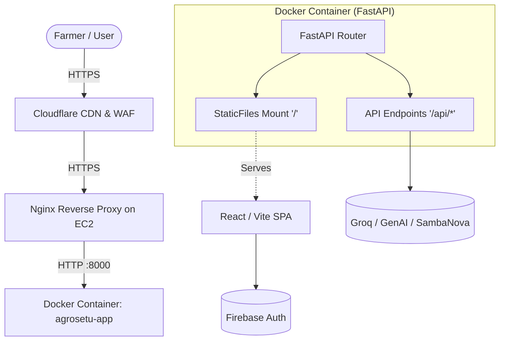
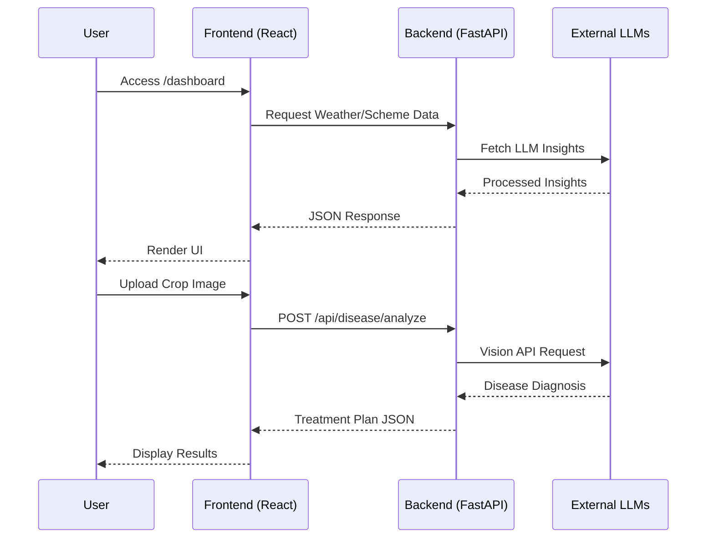
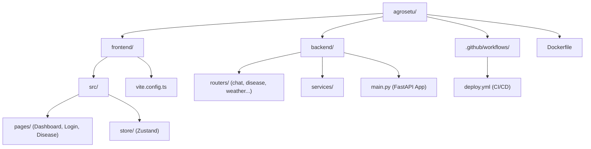

<div align="center">
  <!-- Generated Banner -->
  

  <p align="center">
    <a href="https://reactjs.org/"></a>
    <a href="https://vitejs.dev/"></a>
    <a href="https://fastapi.tiangolo.com/"></a>
    <a href="https://www.docker.com/"></a>
    <a href="https://github.com/appleboy/ssh-action"></a>
  </p>

  <h3>
    <a href="https://kisanseva.me">🚀 Live Production Server</a>
  </h3>
</div>

<br />

> **AgroSetu (KisanSeva)** is an intelligent, scalable full-stack platform designed to empower farmers with climate-resilient practices. The platform leverages modern LLMs (Groq, Google GenAI, SambaNova) to provide real-time agricultural advice, disease detection via image analysis, weather forecasting, and automated government scheme recommendations.

<hr />

## 📖 Table of Contents
- [Project Overview](#-project-overview)
- [Key Features](#-key-features)
- [Tech Stack](#-tech-stack)
- [System Architecture](#-system-architecture)
- [Directory Structure](#-directory-structure)
- [Local Development Setup](#-local-development-setup)
- [Environment Variables](#-environment-variables)
- [Production Deployment](#-production-deployment)
- [Cloudflare & Domain Configuration](#-cloudflare--domain-configuration)
- [Troubleshooting `kisanseva.me`](#-troubleshooting-kisansevame)
- [API Documentation](#-api-documentation)
- [Security & Performance](#-security--performance)

---

## ✨ Key Features

<table>
  <tr>
    <td width="50%">
      <h3>🤖 AI-Powered Chat Assistant</h3>
      <p>Multi-turn conversational AI for instant farming advice powered by Groq and SambaNova.</p>
    </td>
    <td width="50%">
      <h3>🍃 Disease Detection Lens</h3>
      <p>Upload crop images to receive instant disease diagnosis and treatment plans via Google GenAI Vision.</p>
    </td>
  </tr>
  <tr>
    <td width="50%">
      <h3>🌦️ Weather Integration</h3>
      <p>Real-time localized weather insights dynamically pulled and integrated into AI context.</p>
    </td>
    <td width="50%">
      <h3>📜 Government Schemes</h3>
      <p>Automated filtering and recommendations of applicable farming schemes for financial aid.</p>
    </td>
  </tr>
  <tr>
    <td width="50%">
      <h3>🌍 Multi-lingual Support</h3>
      <p>Seamless i18next integration allowing broad accessibility for regional languages.</p>
    </td>
    <td width="50%">
      <h3>💧 Resource Management</h3>
      <p>Dedicated tracking for land, water, and crop rotation schedules.</p>
    </td>
  </tr>
</table>

---

## 🏗️ System Architecture

The application operates as a Dockerized monolith where FastAPI serves both the REST API endpoints and the statically compiled React SPA.



### Application Flow Diagram



---

## 📁 Directory Structure

*(Note: Mermaid labels are properly quoted to prevent parsing errors)*



---

## 💻 Local Development Setup

### Prerequisites
- Node.js (v20+)
- Python (3.10+)

### 1. Frontend Setup
```bash
cd frontend
npm install
npm run dev
```

### 2. Backend Setup
```bash
cd backend
python -m venv venv
source venv/bin/activate  # On Windows: venv\Scripts\activate
pip install -r requirements.txt
uvicorn main:app --reload --port 8000
```

---

## 🔐 Environment Variables

> [!WARNING]
> Never commit `.env` to version control. Use `.env.example` as a template.

| Variable | Location | Description |
|----------|----------|-------------|
| `VITE_FIREBASE_API_KEY` | Frontend | Firebase configuration for Auth |
| `VITE_FIREBASE_PROJECT_ID` | Frontend | Firebase Project ID |
| `GROQ_API_KEY` | Backend | LLM generation for general queries |
| `GEMINI_API_KEY` | Backend | Vision model for disease detection |
| `SAMBANOVA_API_KEY` | Backend | Alternative LLM processing |

---

## 🚀 Production Deployment

Deployment is fully automated via **GitHub Actions**.

### Build Process (Dockerfile)
The `Dockerfile` employs a multi-stage build:
1. **Stage 1 (Node):** Installs dependencies and runs `vite build`, injecting `VITE_FIREBASE_*` build arguments.
2. **Stage 2 (Python):** Installs backend dependencies, copies the `dist` folder from Stage 1 into a `static` folder, and exposes port `8000`.

### CI/CD Pipeline
When code is pushed to the `main` branch, `.github/workflows/deploy.yml` triggers an SSH action to the EC2 instance, rebuilds the Docker image, and restarts the container mapped to **Port 8000**.

---

## 🌐 Cloudflare & Domain Configuration

Your domain `kisanseva.me` is routed through Cloudflare. The setup requires the following for the reverse proxy to function correctly:

1. **DNS Records:**
   - **Type:** A Record
   - **Name:** `@` (and `www`)
   - **Target:** `52.66.238.95`
   - **Proxy Status:** Proxied (Orange Cloud)

2. **Nginx Reverse Proxy on EC2:**
   Nginx intercepts traffic on Port 80/443 and routes it to the Docker container on Port 8000.
   ```nginx
   server {
       listen 80;
       server_name kisanseva.me www.kisanseva.me;
       location / {
           proxy_pass http://127.0.0.1:8000;
           proxy_set_header Host $host;
       }
   }
   ```

---

## 🚨 Troubleshooting `kisanseva.me`

**Issue:** Visiting `https://kisanseva.me/` results in an **ERR_TOO_MANY_REDIRECTS** (Redirect Loop) or fails to load, while `http://52.66.238.95/` returns a 404.

**The Fix:**
1. Log into your **Cloudflare Dashboard**.
2. Navigate to **SSL/TLS -> Overview**.
3. Change the encryption mode from **Flexible** to **Full** or **Full (strict)**.
4. This instructs Cloudflare to connect to Nginx over Port 443 (HTTPS), breaking the loop and securely serving the application.

---

## 🔌 API Documentation

All API routes are prefixed with `/api/`. When deployed, Swagger UI documentation is automatically generated and accessible at `/docs`.

- `POST /api/disease/analyze` - Accepts multipart form data (images) for GenAI crop disease detection.
- `GET /api/weather/current` - Fetches localized weather data.
- `POST /api/chat/message` - Handles multi-turn streaming conversations via Groq.
- `GET /api/schemes/list` - Returns filtered government schemes.

---

## 🛡️ Security & Performance

- **Rate Limiting:** Cloudflare WAF handles basic DDoS mitigation and rate limiting.
- **CORS:** Controlled via FastAPI `CORSMiddleware`.
- **Static Assets:** Cached dynamically via Cloudflare (`cf-cache-status: DYNAMIC`).
- **State Management:** React Query is utilized for efficient client-side data fetching, caching, and background synchronization, significantly reducing unnecessary backend API calls.

---
<div align="center">
  <i>Developed for the SamaSocial Hackathon.</i>
</div>
